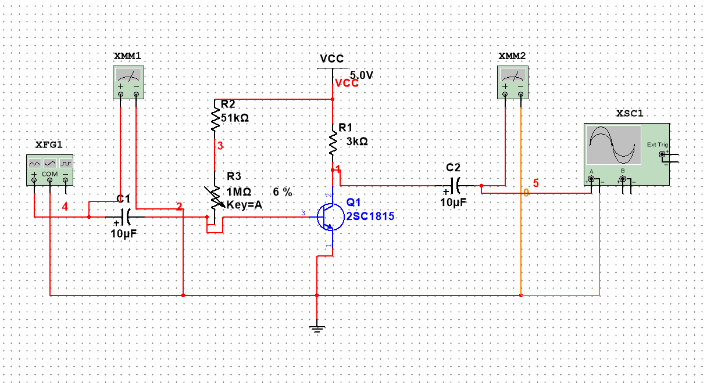

# 单极放大电路仿真实验
---
### 电路实验图如下:

---

1. **电位器的选择**
   电位器可以设置快捷键使得能够仿真过程中改变其电路的阻值，可以***动态***地看到其阻制变化对电路带来的影响

2. **函数发生器的使用和接法**
   * 函数发生器的**接地端**是中间的COM
   * 其他没啥了
3. **示波器的使用**
   * 一般情况下右边的触发选择自动触发，此时的扫描速度很快，当电路中的参数改变时(如电位器电阻改变)示波器可以实时看到波形的变化**如果想看到稳定的波形可以使用单次触发，但此时扫描速度很慢，看不到动态的变化**
4. <u>实验具体原理晚点再看</u>
   
   ---
